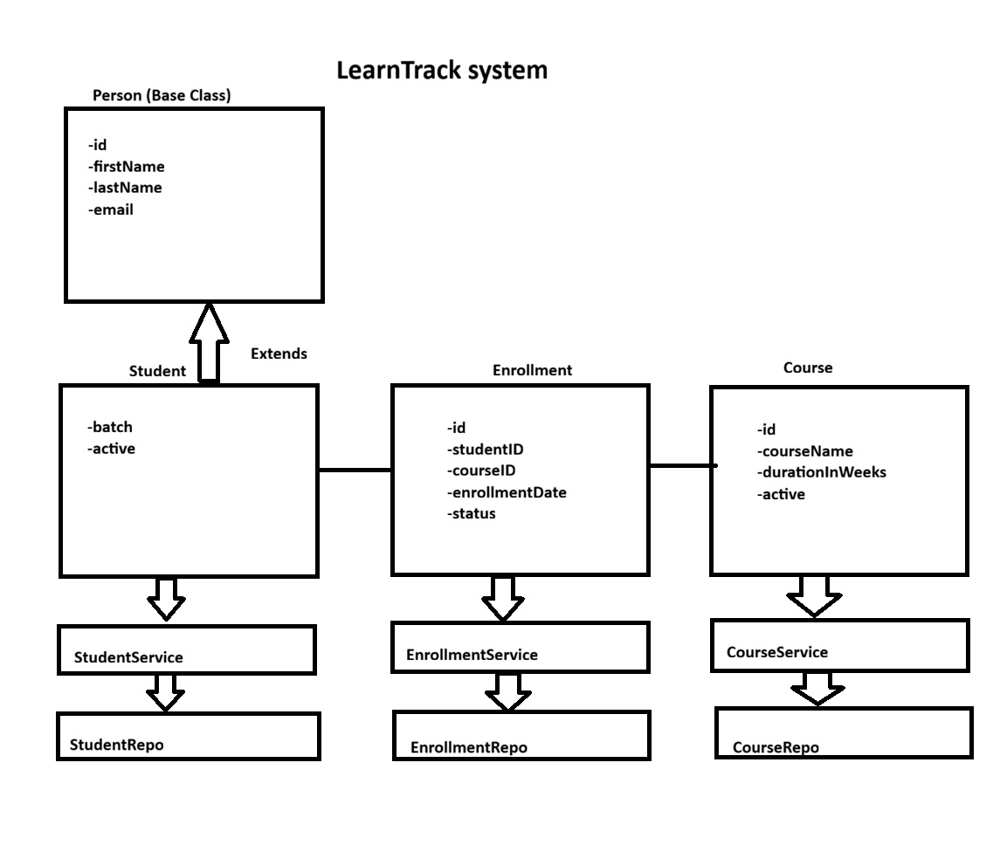

# LearnTrack - Student & Course Management System

## About the Project
LearnTrack is a console-based application developed using Core Java. I built this project to practice Java fundamentals and understand how to structure a real-world application.

The system allows basic management of students, courses, and enrollments through a menu-driven interface. The main goal was to apply concepts like OOP, collections, and exception handling in a practical way.

## Features

### Student Management
- Add a new student
- View all students
- Search a student using ID
- Deactivate a student instead of deleting

### Course Management
- Add a new course
- View all courses
- Deactivate a course

### Enrollment Management
- Enroll a student into a course
- View all enrollments
- Update enrollment status (ACTIVE, COMPLETED, CANCELLED)

## What I Learned
While working on this project, I got hands-on experience with:

- Writing clean and structured Java code
- Using classes and objects effectively
- Applying inheritance (Student extends Person)
- Encapsulation using private fields and getters/setters
- Basic polymorphism using method overriding
- Working with ArrayList for dynamic data storage
- Handling errors using try-catch and custom exceptions
- Organizing code into layers (UI, Service, Repository)

## Project Structure
The project is divided into multiple packages to keep the code clean and organized:

- Main.java – Entry point of the application  
- entity – Contains model classes like Student, Course, and Enrollment  
- repository – Handles in-memory data storage using ArrayList  
- service – Contains business logic  
- exception – Custom exception classes  
- util – Utility classes like IdGenerator  
- constants – Stores application constants  
- enums – Contains fixed values like EnrollmentStatus  

## How to Run

- Open the project in VS Code
- Open Main.java
- Click the Run button

## Notes
- This project uses in-memory storage, so data will reset when the program is restarted  
- The focus of this project is on learning core Java concepts, not database integration  

This diagram represents the overall structure of my LearnTrack system.

## Entities

At the top, I have a base class called Person which contains common fields like id, firstName, lastName, and email.

Student extends Person, so it inherits these properties and also has additional fields like batch and active status.

 ## Relationship 

The main relationship in the system is between Student and Course.

A student can enroll in multiple courses, and a course can have multiple students.

So instead of directly connecting them, I created an Enrollment class to handle this many-to-many relationship.

Each Enrollment stores studentId, courseId, enrollmentDate, and status.

 Service Layer

Below that, I have service classes like StudentService, CourseService, and EnrollmentService.

These classes contain the business logic, such as adding students, creating courses, and enrolling students.

Repository Layer

I also created repository classes for each entity to store data in memory using ArrayList.

This helps in separating data storage from business logic.

## Design Decision

Overall, I followed a layered architecture with entity, repository, and service layers to keep the code clean and modular.

## Author
Niha2048
